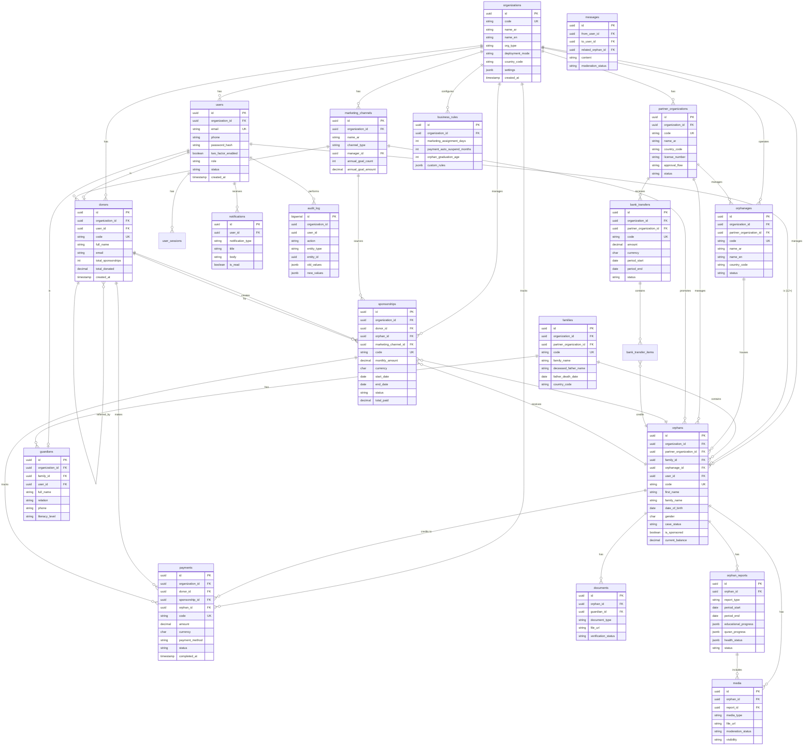

# 🗺️ Rufaqaa Entity Relationship Diagram (ERD)

## Database Structure — منصة رفقاء



---

## العلاقات الرئيسية الموضحة

### 1. Multi-Tenancy
```
organizations (1) ──── (∞) كل الجداول
   كل جدول له organization_id لعزل البيانات
```

### 2. The Core Triangle
```
donors ←─── sponsorships ───→ orphans
              │
              ↓
           payments
```

### 3. Family / Residence Structure
```
families (1) ──── (∞) orphans      (family home: orphans.orphanage_id IS NULL)
   └── (∞) guardians

orphanages (1) ──── (∞) orphans    (dar / institution: orphans.orphanage_id set)
```

### 4. Marketing Pipeline
```
marketing_channels (1) ──── (∞) orphans (assigned)
                       │
                       └─── (∞) donors (acquired)
                       │
                       └─── (∞) sponsorships (sourced)
```

### 5. Financial Flow
```
donors → payments → sponsorships → orphans (balance)
                                       │
                                       ↓
                              partner_organizations
                                       │
                                       ↓
                              bank_transfers → bank_transfer_items
```

### 6. Document & Media Hierarchy
```
orphans (1) ──── (∞) documents
   │
   └─── (∞) media (photos, videos)
   │
   └─── (∞) orphan_reports
              └─── (∞) media (linked to specific reports)
```

### 7. Communication
```
users ←─── messages ───→ users
              │
              └── related_orphan (context)
```

### 8. Audit & Security
```
users ──── (∞) audit_log (every action)
users ──── (∞) user_sessions (login tracking)
users ──── (∞) notifications (alerts)
```

---

## القواعد الجوهرية على مستوى DB

### قاعدة 1: عدم تكرار اليتيم
```sql
UNIQUE INDEX (
    organization_id,
    first_name,
    family_name,
    date_of_birth,
    father_name
) WHERE deleted_at IS NULL
```

### قاعدة 2: عدم تكرار الكفالة
```sql
UNIQUE INDEX (donor_id, orphan_id)
WHERE status IN ('active', 'paused', 'overdue')
```

### قاعدة 3: عزل المؤسسات (RLS)
```sql
كل جدول له:
CREATE POLICY org_isolation
USING (organization_id = current_setting('app.current_org_id'))
```

### قاعدة 4: Audit Log غير قابل للتعديل
```sql
CREATE RULE no_update_audit AS ON UPDATE TO audit_log DO INSTEAD NOTHING;
CREATE RULE no_delete_audit AS ON DELETE TO audit_log DO INSTEAD NOTHING;
```

---

## ID Generation Pattern

| الكيان | البادئة | المثال |
|------|---------|--------|
| Organization | ORG- | ORG-00001 |
| Orphan | ORF- | ORF-00045 |
| Donor | DON- | DON-00123 |
| Sponsorship | KAF- | KAF-00089 |
| Payment | PAY- | PAY-01240 |
| Bank Transfer | TRF- | TRF-00033 |
| Partner | PTN- | PTN-00007 |
| Family | FAM- | FAM-00012 |
| Orphanage | DAR- | DAR-00003 |

---

## الحجم المتوقع

```
لمؤسسة كبيرة (5 سنوات):

orphans:              100,000 صف
guardians:             80,000 صف
families:              50,000 صف
donors:               500,000 صف
sponsorships:         600,000 صف
payments:           5,000,000 صف
documents:          1,000,000 صف
media:              5,000,000 صف
orphan_reports:     1,200,000 صف
notifications:     50,000,000 صف
audit_log:        100,000,000 صف

الحجم الإجمالي: ~ 500 GB
```

---

## التوصيات للأداء

```
✅ Partitioning للجداول الكبيرة:
   - payments by month
   - audit_log by month
   - notifications by month

✅ Read Replicas للقراءة الثقيلة

✅ Materialized Views للإحصاءات

✅ Indexes استراتيجية في كل جدول

✅ Cursor-based pagination

✅ Connection pooling (PgBouncer)
```
